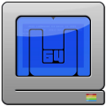
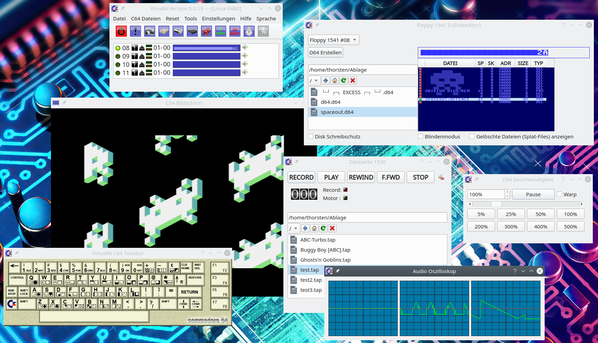

# EMU64 - Der C64 Emulator


**EMU64** ist ein Emulator für den Commodore 64, einen legendären Home-Computer aus den 1980er Jahren. Das Projekt bietet authentische Emulation mit umfangreichen Features für Retro-Gaming und Softwareentwicklung.

### [Letzte offizielle Linuix & Windows Version](https://github.com/ThKattanek/emu64/releases/latest)
(Die Windows Version (32 + 64Bit) läuft auch unter Linux mit Wine - getestet unter Kubuntu 26.04 LTS)

## Inhaltsverzeichnis
- [Features](#features)
- [Links](#links)
- [Screenshot](#screenshot)
- [Installation](#emu64-erstellen-unter-linux)
- [Lizenz](#lizenz)

## Features
- Authentischer Commodore 64 Emulator
- Multi-Plattform Support (Windows, Linux)
- SDL2-basierte Audio- und Video-Ausgabe
- Unterstützung für verschiedene Roms und Dateiformate
- Qt6 oder Qt5 GUI

## Links
**Homepage:** [https://www.thorsten-kattanek.de/index.php/projekte/emu64](https://www.thorsten-kattanek.de/index.php/projekte/emu64)

**YouTube:** [Emu64 News Playlist](https://www.youtube.com/playlist?list=PLPygkia21sCKyHtZ9DGkWhHrq3bF9fMhY) | [Emu64 Tutorial Playlist](https://www.youtube.com/playlist?list=PLPygkia21sCLN7UtYWqpuGRjmC6OTV8mY)

**Facebook:** [https://www.facebook.com/Emu64-103321833093172](https://www.facebook.com/Emu64-103321833093172)

## Screenshot


## Installation

### Emu64 erstellen unter Linux

#### Wichtige Voraussetzungen
- qttools6-dev oder qt5

#### Erforderliche Bibliotheken
- qt6 oder qt5
- sdl2
- sdl2-image
- png
- quazip5
- ffmpeg (mit: avcodec, avutil, swresample, avformat, swscale)

#### Build- und Installationsanleitung
```bash
git clone https://github.com/ThKattanek/emu64.git
cd emu64
# Optional: Eine spezifische Release-Version verwenden (z.B. 5.2.0)
# git checkout 5.2.0
mkdir build
cd build
qmake6 .. PREFIX="/usr/local"
make -j$(nproc)
sudo make install
```

#### Übersetzung aktualisieren
Um die Übersetzung auf andere Sprachen zu aktualisieren, müssen die `*.ts`-Dateien aktualisiert werden:

```bash
lupdate emu64.pro
# oder
lupdate src/src.pro
```

Danach können Sie mit dem QLinguist-Tool die entsprechende `*.ts`-Datei laden und neue Wörter übersetzen. Nach dem Speichern werden die `qm`-Dateien automatisch beim Kompilieren erzeugt.

#### Fehlerbehebung: "make install"
Falls dieser Fehler auftritt:
```
Aufruf von stat für '.qm/emu64_de.qm' nicht möglich: Datei oder Verzeichnis nicht gefunden
```

Führen Sie folgende Befehle aus:
```bash
mkdir src/.qm
lrelease ../src/src.pro
cp ../src/*.qm src/.qm
sudo make install
```

#### Deinstallation
```bash
xargs rm < install_manifest.txt
```

**Hinweis:** Verzeichnisse, die während der Installation erstellt wurden, werden nicht entfernt, aber alle Dateien werden gelöscht.

#### Weitere Informationen
Detaillierte Anleitungen für ein Windows-Build mit MXE:
- [Windows-Versionen unter Linux mit MXE erstellen](https://github.com/ThKattanek/emu64/wiki/Windows-Build-unter-Linux-mit-MXE-erstellen)

## Lizenz
Dieses Projekt ist unter der GNU General Public License v2 (GPLv2) lizenziert. Siehe [LICENSE](LICENSE) für Details.