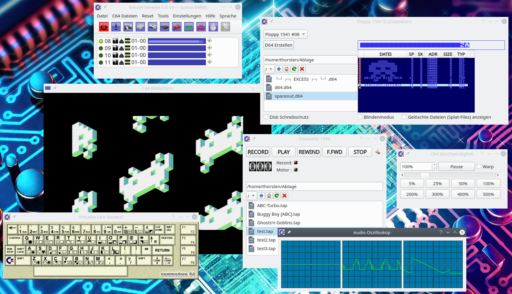

# EMU64 - Der C64 Emulator

### [Letzte Offizelle Windows Version hier](https://github.com/ThKattanek/emu64/releases/latest)
(Die 32-bit Windows Version läuft auch unter Linux mit Wine (getestet unter Kubuntu 20.04))

Emu64 Homepage: [https://forum.emu64.net](https://forum.emu64.net)

Emu64 auf YouTube: [Emu64 News Playlist](https://www.youtube.com/playlist?list=PLPygkia21sCKyHtZ9DGkWhHrq3bF9fMhY) / [Emu64 Tutorial Playlist](https://www.youtube.com/playlist?list=PLPygkia21sCLN7UtYWqpuGRjmC6OTV8mY)

Emu64 auf Facebook: [https://www.facebook.com/Emu64-103321833093172](https://www.facebook.com/Emu64-103321833093172)

## Screenshot


## Emu64 erstellen unter Linux

### Wichtige Vorraussetzung
- qttools5-dev

### Benötigte Libs 
- qt5
- sdl2
- sdl2-image
- png
- quazip5
- ffmpeg
  - avcodec
  - avutil
  - swresample
  - avformat
  - swscale

### Build und Installation
```bash
git clone https://github.com/ThKattanek/emu64.git
cd emu64
git checkout 5.0.19
mkdir build
cd build
qmake .. PREFIX="/usr/local"
make -j8
sudo make install
```
### Wenn folgender Fehler bei "make install" kommt:
```code
Aufruf von stat für '.qm/emu64_de.qm' nicht möglich: Datei oder Verzeichnis nicht gefunden
```
### Dann:
```bash
mkdir src/.qm
lrelease ../src/src.pro
cp ../src/*.qm src/.qm
sudo make install
```

### Deinstallieren
```bash
xargs rm < install_manifest.txt
```
Achtung! Verzeichnisse die durch die Installation erstellt wurden werden hiermit nicht entfernt, jedoch alle Dateien die erstellt wurden.

### Detailierte Beschreibungen für verschiedene Linux Distributionen

[Kompilieren unter Debian 10.0.0](https://github.com/ThKattanek/emu64/wiki/Emu64-auf-Debian-10.0.0-kompilieren)

[Windows Versionen unter Linux mit MXE](https://github.com/ThKattanek/emu64/wiki/Windows-Build-unter-Linux-mit-MXE-erstellen)

